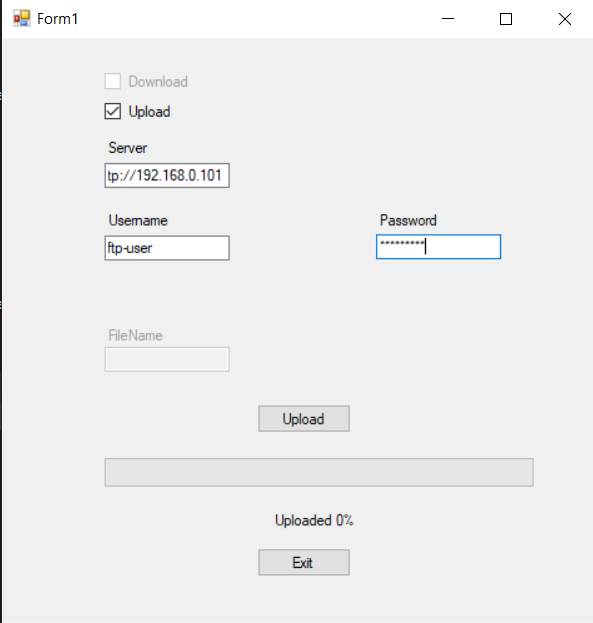
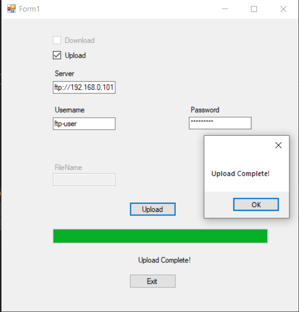
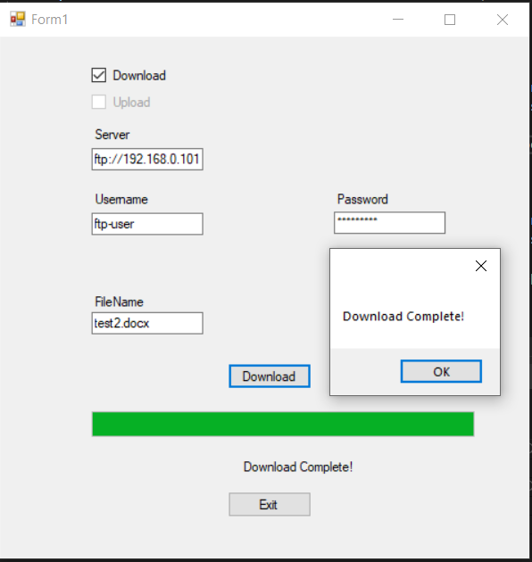
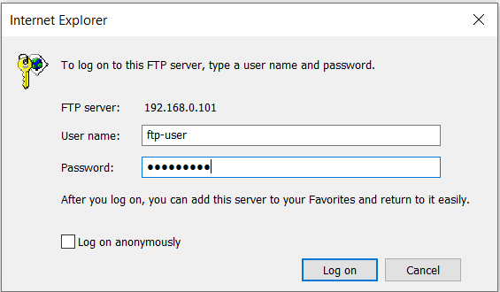
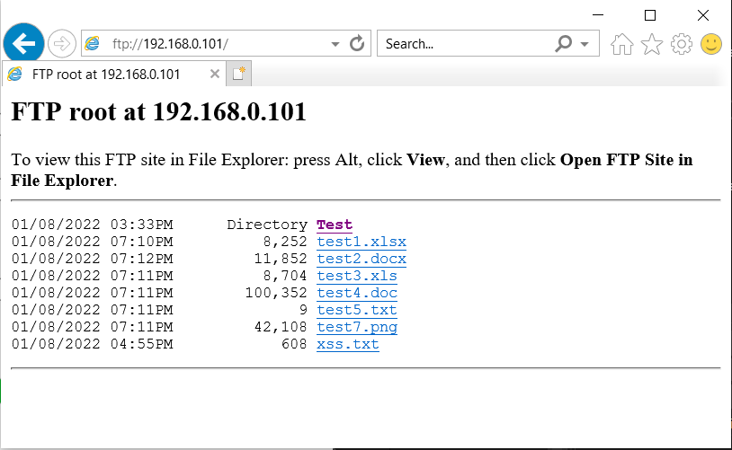

# Tema

Zhvillimi i aplikacionit që mundëson që fajllat me ekstension .doc, .docx, .xls, .xlsx në një folder të caktuar të ngarkohen në një FTP server të caktuar.

## Teknologjia e përdorur

- Sistemi Operativ - Windows 10 Pro
- Gjuha Programuese - C# 

## Përshkrimi i detyrës

Në këtë detyrë është treguar si të realizojmë shkëmbimin e skedarëve nga një folder i caktuar në një FTP Server përmes ftpwebrequest në C#.

Duke shfrytëzuar Windows Forms App(.Net Framework) fillimisht kemi krijuar formën pastaj për secilën pjesë edhe kodin përkatës.

## File Transfer Protocol (FTP) 

FTP është një protokoll standard që përdoret për transferimin e të dhënave ndërmjet një klienti dhe një serveri në një rrjet kompjuterik. Një FTP klient mund të lidhet me një FTP server për të manipuluar me fajllat.
Qëllimet e FTP-së janë:
Promovimi i shpërndarjes së skedave (programve kompjuterike dhe/ose të dhënave).
Frymëzimi i përdorimit direkt apo indirekt të remote computer (kompjuterëve nga largësia).
Mbrojtja e një përdoruesi nga variacionet e sistemeve të ruajtjes së skedave mes hostëve të ndryshëm.
Transferimi i të dhënave në mënyrë të besueshme dhe efikase.

## Puna me FTP në C#

Fillojmë një lidhje me serverin FTP me të cilin duam të hapim një lidhje komunikimi.

> `FtpWebRequest request = (FtpWebRequest)WebRequest.Create(new Uri(string.Format("{0}/{1}", Server, Filename)))`  

Pas lidhjes me server shkruajme edhe emrin e përdoruesit dhe fjalëkalimin me te cilat kemi krijuar FTP serverin. Nëse kredencialet tona verifikohen, ne kemi hyrë në server dhe mund të fillojmë të dërgojmë më shumë komanda.

> ` request.Credentials = new NetworkCredential(Username, Password)`

### Ngarkimi i skedarëve

Ngarkimi i skedarëve bëhet me metodën:

> ` request.Method = WebRequestMethods.Ftp.UploadFile`  

### Shkarkimi i skedarëve

Shkarkimi i skedarëve nga një server FTP përfshin metodën:

> ` request.Method = WebRequestMethods.Ftp.DownloadFile `  

 ### Hapja e FTP serverit në Browser
 
 

 
 
 ## Anëtarët

[Laura Gashi](https://github.com/LauraGashi)

[Mihrije Ibrahimi](https://github.com/MihirijeIbrahimi)

[Nida Islami](https://github.com/nidaislami)

